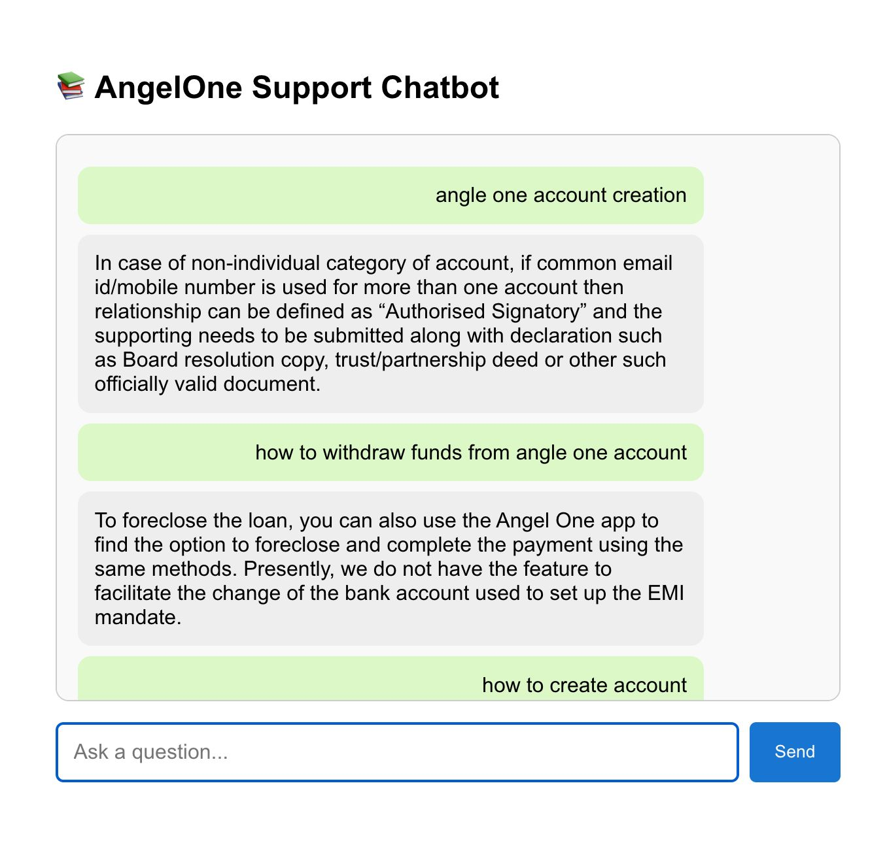

# RAG_AngleOne

## Overview

**RAG AngleOne** is a Retrieval-Augmented Generation (RAG) chatbot designed to assist users with queries related to Angel One’s customer support documentation. The bot leverages advanced retrieval and generation techniques to provide accurate, context-aware answers strictly based on the provided support sources. If a question falls outside the available documentation, the bot responds with “I don’t know,” ensuring reliability and compliance with assignment requirements.

---

## Features

- **Retrieval-Augmented Generation:** Combines semantic search (retrieval) with generative AI for precise, context-based answers.
- **Source-Constrained Answers:** Only responds using information from the provided Angel One support documentation and insurance PDFs.
- **Graceful Fallback:** Replies with “I don’t know” for out-of-domain queries.
- **Modern Web UI:** Clean, user-friendly React frontend for chat interaction.
- **Automated Web Scraping:** Scripts included to extract and preprocess support articles from Angel One’s website.
- **Scalable Vector Search:** Uses Pinecone for fast, scalable document retrieval.
- **Easy Deployment:** FastAPI backend with CORS enabled for frontend integration.

---

## Tech Stack

- **Frontend:** React (Create React App), Axios
- **Backend:** FastAPI, LangChain, Sentence Transformers, Pinecone, HuggingFace Inference API
- **Vector Database:** Pinecone (cloud-hosted, serverless)
- **Embeddings:** `all-MiniLM-L6-v2` via Sentence Transformers
- **Web Scraping:** BeautifulSoup, Selenium (automated extraction)
- **Environment Management:** Python `venv`, `.env` files for secrets

---

## Directory Structure

```
rag-bot-fresh/
├── backend/
│   ├── main.py                # FastAPI server
│   ├── rag.py                 # RAG logic (retrieval + generation)
│   ├── ingestion.py           # Data ingestion to Pinecone
│   ├── scrape_support_articles.py # Web scraping script (Angel One support)
│   ├── requirements.txt
│   ├── .env                   # API keys (not committed)
│   └── data/
│       ├── pdfs/              # Insurance PDFs
│       └── web_content/       # Scraped support articles
├── frontend/
│   └── rag_angleone/
│       ├── src/
│       │   ├── App.js         # Chatbot UI
│       │   └── ...
│       ├── public/
│       └── .env               # Frontend API URL
└── README.md                  # (You are here)
```

---

## Setup Instructions

### 1. Backend

#### Prerequisites

- Python 3.10+
- [Pinecone](https://www.pinecone.io/) account (API key)
- [HuggingFace](https://huggingface.co/) account (API key)
- (Optional for scraping) Chrome browser

#### Installation

```bash
cd backend
python3 -m venv venv
source venv/bin/activate
pip install -r requirements.txt
```

#### Environment Variables

Create a `.env` file in `backend/`:

```
PINECONE_API_KEY=your-pinecone-key
HF_API_KEY=your-huggingface-key
```

#### Data Ingestion

1. **Web Scraping (Optional, already scraped data included):**
   - To update or re-scrape Angel One support docs:
     ```bash
     python scrape_support_articles.py
     ```
   - Scraped files will be saved in `data/web_content/`.

2. **Ingest Data into Pinecone:**
   ```bash
   python ingestion.py
   ```
   - This will split, embed, and upload all PDFs and text files to your Pinecone index.

#### Run the Backend Server

```bash
uvicorn main:app --reload
```
- By default, runs at `http://127.0.0.1:8000`

---

### 2. Frontend

#### Installation

```bash
cd frontend/rag_angleone
npm install
```

#### Environment Variable

Create a `.env` file in `frontend/rag_angleone/`:

```
REACT_APP_API_URL=http://127.0.0.1:8000
```

#### Start the Frontend

```bash
npm start
```
- App runs at [http://localhost:3000](http://localhost:3000)

---

## Usage

- Enter your question in the chat window.
- The bot will respond based only on the indexed Angel One support documentation and insurance PDFs.
- For any query outside the provided sources, the bot will reply: **“I don’t know”**.

---

## Deployment

- The backend is ready for deployment on any cloud (see `render.yaml` for Render.com example).
- Ensure your Pinecone and HuggingFace API keys are set securely in your deployment environment.

---

## Notes

- **Pinecone** is used for fast, scalable vector search, enabling efficient retrieval of relevant support content.
- **Automated Web Scraping**: The included script (`scrape_support_articles.py`) can be used to refresh or expand the knowledge base as Angel One updates their support site.
- **Security**: Never commit `.env` files or API keys to version control.

---

## Screenshots



---

